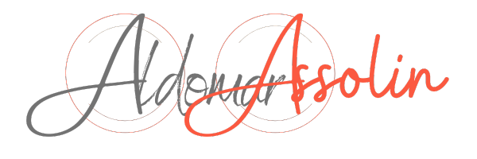
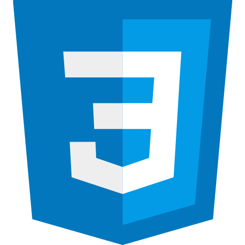
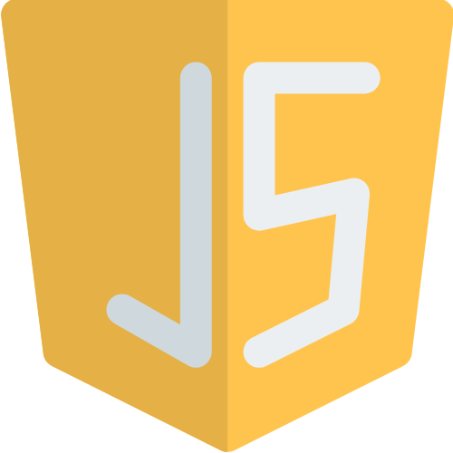
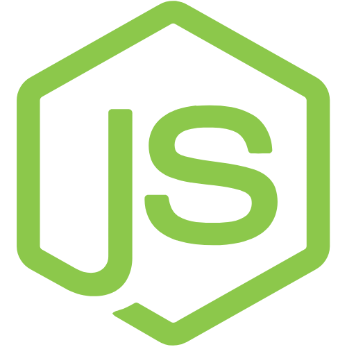
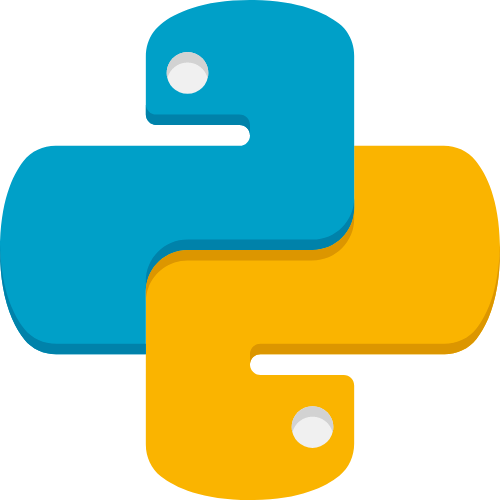
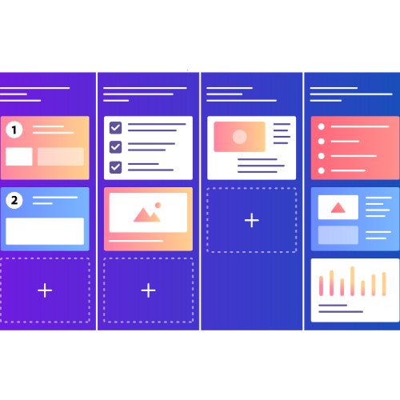

    

## 🚀 Sobre mim
# Me chamo Aldomar Assolin
Tenho 39 anos, sou do interior do Rio Grande do Sul.
Estou cursando Análise e Desenvolvimento de Sistemas, atualmente no 3° semestre.

<!-- 

 -->

<!-- 

 -->

### Habilidades

 
 
 

 
 
 
  
 

<!-- 

 -->

  <h3>Stats</h3>

 

  

  

<!-- 

 -->

### 🔗 Links

**Loanding**...

  <!-- 
  
   -->

<!-- 
    
  
  
  
  

  
  
  
  -->