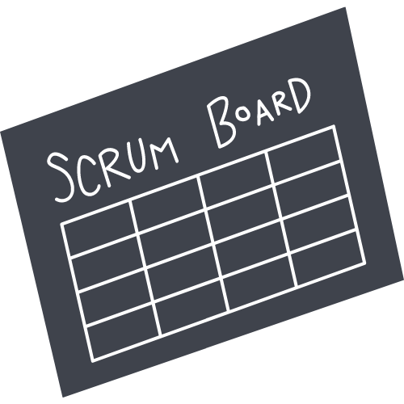

    

# 🚀 Sobre mim
Meu nome é Aldomar Assolin, também conhecido como Manex. Trabalhei por mais de 15 anos na área de soldagem, atualmente estou em processo de migração de carreira, cursando o tecnólogo de Análise e Desenvolvimento de Sistemas, já no 5º semestre. Sou apaixonado por programação e constantemente busco aprimorar minhas habilidades técnicas e conhecimentos.

## Habilidades

### Frontend
- HTML
- CSS
- JavaScript
- React

     
     
    
     

### Backend
- Node.js
- PHP
- Python
- Java

     
     
     
     

### Banco de Dados
- PostgreSQL
- MySQL
- SQL

     
     
     
     

### Outras Tecnologias
- Spring Boot
- JPA (Java Persistence API)
- Jackson
- Express
- Mongoose

     
      
     
    
     

## Projetos Destacados

1. [MarvelApp](https://github.com/AldomarAssolin/MarvelApp): Estudando APIs em JavaScript.
2. [Hoteis Básico Front](https://github.com/AldomarAssolin/hoteis-basico-front): Projeto em HTML e CSS.
3. [Revenda de Carros](https://github.com/AldomarAssolin/revenda-de-carros): Projeto em HTML.
4. [Money App](https://github.com/AldomarAssolin/money-app): Curso React com Redux (Coder).
5. [Clone Danki](https://github.com/AldomarAssolin/clone_danki): Estudos em React - Clone do site Danki Code.
6. [Projeto Hotel](https://github.com/AldomarAssolin/projeto-hotel): Site simples para estudos de HTML.

## Estatísticas do GitHub

### 🔗 Links

## Interesses Pessoais

Além da tecnologia, sou apaixonado por música, especialmente Rock'n Roll, e adoro viajar de moto. Essas paixões complementam meu perfil profissional, trazendo equilíbrio e inspiração para minha carreira em tecnologia.

## Licença

Este perfil está licenciado sob a Licença MIT. Veja o arquivo [LICENSE](LICENSE) para mais detalhes.

  

