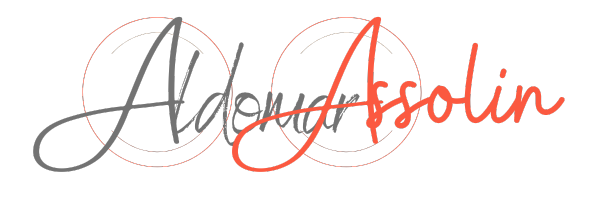
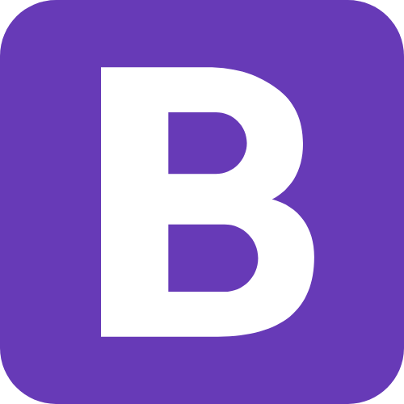
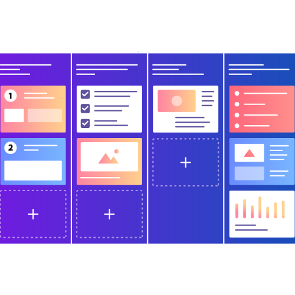
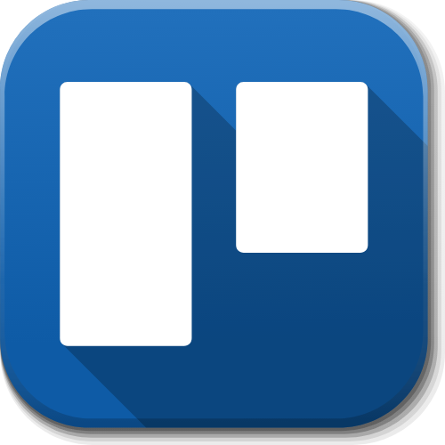
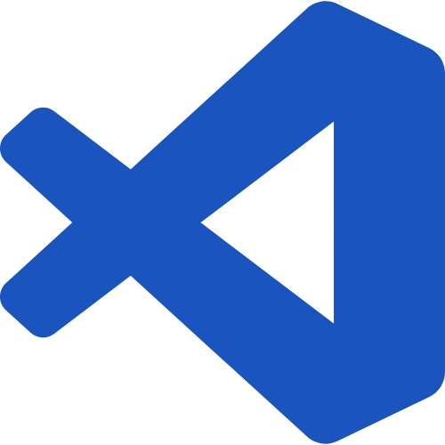
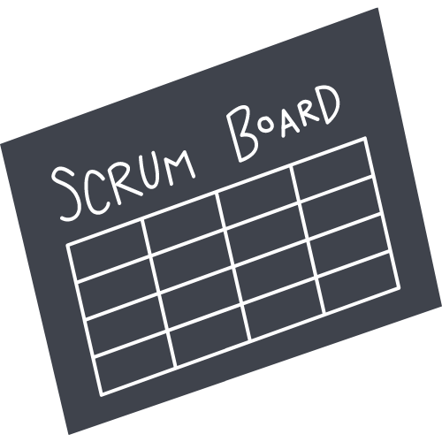

    

# 🚀 Sobre mim

# Olá, eu sou o Aldomar Assolin — Manex! 👋😄

Profissional em **transição da Indústria Metalúrgica para Tecnologia**, unindo mais de 15 anos de experiência em soldagem, processos produtivos e liderança com minha formação em **Análise e Desenvolvimento de Sistemas (5º semestre)**.

Sou apaixonado por **desenvolvimento de software, automação de processos, APIs, Inteligência Artificial e soluções para Indústria 4.0**.  
Meu foco atual é evoluir como **Full Stack Developer** usando **Java + Spring Boot, Python, PHP, React e automações com n8n**.

---

## 🛠️ Habilidades Técnicas

| Frontend | Backend | Banco de Dados | Outras Tecnologias |
|---|---|---|---|
|  |  |  | Spring Boot |
|  |  |  | JPA / Hibernate |
|  |  |  | Express |
|  |  |  | Mongoose |

    
      
     
    
       

---

## 🔨 Projetos Destacados

### ✔ Screammatch JPA — API OMDB
API em Java + Spring Boot + JPA, integrando com a OMDB API e persistindo dados em PostgreSQL.  
🔗 **Repositório:** https://github.com/AldomarAssolin/screammatchJPA

---

### ✔ Gutendex Library — API Gutendex
Aplicação para consumo da API Gutendex, com filtros, buscas e persistência.  
🔗 **Repositório:** https://github.com/AldomarAssolin/gutendexLib

---

### ✔ VollMed — Agenda de Consultas
API completa para cadastro de médicos, pacientes e agendamento de consultas.  
🔗 **Repositório:** https://github.com/AldomarAssolin/clinicaMedica

---

## 🧩 Áreas de Interesse e Atuação

- Desenvolvimento Full Stack (Java, PHP, Python, React)
- APIs REST com Spring Boot e Flask
- Automação de processos com **n8n**
- Integrações WhatsApp, Supabase, CRMs, Webhooks
- Estruturação de banco de dados relacional e NoSQL
- Indústria 4.0, processos produtivos e Lean
- Mentoria e estudos em IA aplicada (LangChain, RAG, embeddings)

---

## 📊 Estatísticas do GitHub

---

## 🔗 Redes e Contato

---

## 🏍 Interesses Pessoais

Além da tecnologia, sou apaixonado por **Rock’n Roll**, motocicletas e viagens. Essas experiências trazem equilíbrio, foco e criatividade para minha jornada como desenvolvedor.

---

## ✔ Licença

Este perfil está sob a Licença MIT. Consulte o arquivo [LICENSE](LICENSE) para mais detalhes.

  

